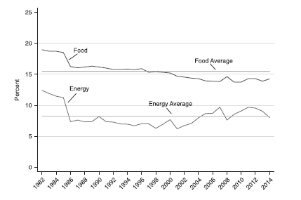
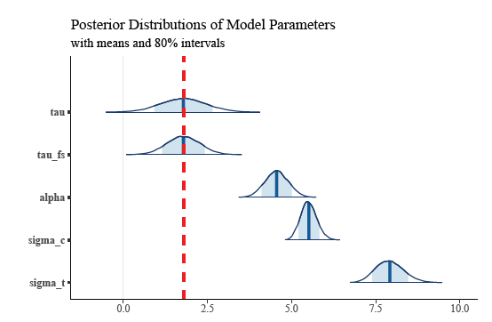
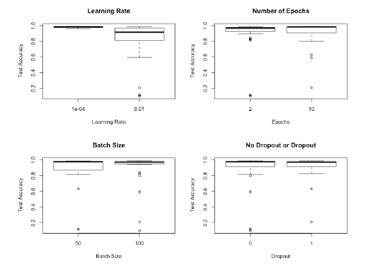
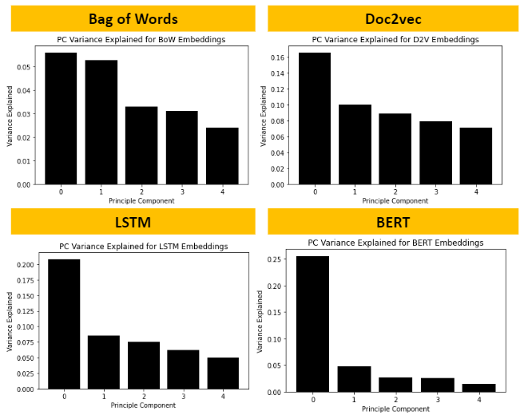
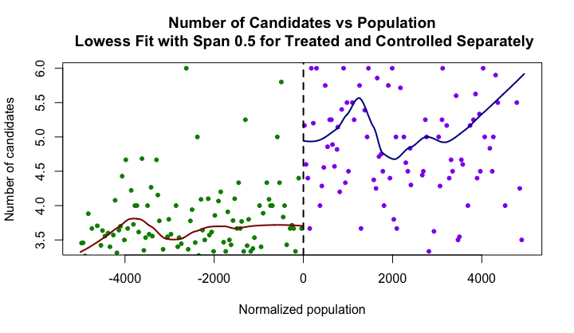
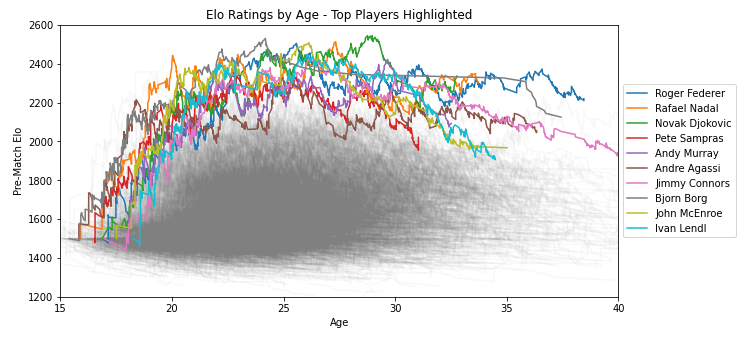

### [Home](README.md) | [Projects](Projects.md) | [Notes](Notes.md) | [Resume](docs/Adam_R_Rohde_Resume.pdf)

---

Find my latest projects below! More to come! See my resume for brief descriptions of my work at Charles River Associates. 

### Sample Selection and Instrumental Variable Estimates within the Sample: Threats and Opportunities (In Progress)
with Chad Hazlett

The instrumental variables approach has been presented as a potential solution to suspicions that standard causal effect estimates may be biased by unobserved confounders. The requirements for a valid instrumental variable are demanding. Even when these demands are met, we typically estimate such an effect from a sample of units, which is selected in some not necessarily random way. To address the question of whether the sample selection process biases the instrumental variables estimate as it pertains to the sample in hand, we need a formal and rigorous framework for determining when causal effect estimates in the given sample have been biased by sample selection processes, when the correct estimate can be recovered, and how. To this end we propose formal graphical criteria for unbiased, internally
valid instrumental variables estimates, and provide tools enabling researchers to easily determine how sample
selection may bias their estimates across their study sample, as well as what might
be able to be done to correct any bias. While highlighting the high bar for instrument validity, our framework also illuminates suprising opportunities for the use of instrumental variables approaches.

---

### Revisiting Sample Selection as a Threat to the Validity of Causal Effect Estimates in the Sample: An Adjustment Criterion, Examples, and Lessons (In Progress)
with Chad Hazlett

Researchers often seek to estimate the causal effect of some treatment on some outcome. Typically,
we estimate such an effect from a sample of units, which is selected in some not necessarily random
way. In recent years, considerable attention has been given to the challenges of either generalizing
these estimates to the population from which the sample was selected or "transporting" them to
another population of interest. However, another long-standing concern of central interest to many
investigators is whether the sample selection process also biases the causal effect estimate even as it
pertains to the sample in hand. In keeping with research traditions in a number of disciplines, we
consider the property of "internal validity," meaning that an estimate is unbiased for the target causal
effect averaged over the sample in hand. While different research traditions have proposed informal
guidelines for determining when sample selection threatens internal validity, it is now possible to
conduct a more formal and rigorous treatment that determines when causal effect estimates in the
given sample have been biased by sample selection processes, when the correct estimate can be
recovered, and how. To this end we propose a formal graphical criterion for unbiased, internally
valid causal effect estimates, and provide tools enabling researchers to easily determine how sample
selection may bias their estimates of causal effects across their study sample, as well as what might
be able to be done to correct any bias.

---

### Sensitivity Analysis for Endogenous Sample Selection Bias (In Progress)
with Chad Hazlett

Endogenous sample selection bias is central threat to the internal validity of causal effect estimates as they pertain to the selected sample in hand. We aim to develop an intuitive sensitivity analysis framework to evaluate how estimated regression coefficients maybe biased in light of potential violations to the assumption of no endogenous selection bias. We show that this can be cast in an omitted variables framework and that bias can be parameterized simply. We then explore difficulties in the interpretation of one of these parameters. We show that various additional assumptions can allow for improved interpretation and discuss bounding.

---
### An Extension to Stability Controlled Quasi Experiments (In Progress)
with Chad Hazlett

Stability controlled quasi experiments (SCQEs) have been used to study newly adopted nonrandomized treatments. They rely on a "baseline trend" assumption on the change in average nontreatment potential outcome over two time periods in which data is available (one in which no one has been treated and one in which the treatment has begun to be adopted). We expand this framework to cover cessation of treatment across the time periods. In previous SCQEs, the average treatment effect among the treated has been identified. We show how the average treatment effect among the untreated and across the entire population can be identified using similar trend assumptions. We aim to illustrate this method using data on smoking cessation.

---
### Big Data Big Problems (In Progress)
with Chad Hazlett and Carlos Cinelli

Building off of Cinelli and Hazlett (2020), we use sensitivity analysis in linear regression models to highlight a simple fact: large samples make it more likely that weak (or spurious) relationships will be statistically significant, which can mislead practitioners. Discussion of effect importance ought to incorporate uncertainty from identification as well as estimation. The focus of this paper is to demonstrate that this becomes increasingly more important as sample size increases.

---
### Rational Bias in Inflation Expectations
with Robert Murphy

Using generalized method of moments, estimated a structural model of the economy to directly test hypotheses about whether inflation expectations respond rationally to food and energy price movements.

Murphy, R., Rohde, A. Rational Bias in Inflation Expectations. Eastern Econ J44, 153–171 (2018) doi:10.1057/eej.2015.50

[Paper](https://link.springer.com/article/10.1057%2Feej.2015.50)

[Final Working Version](docs/Rational-Bias-in-Inflation-Expectations-Working.pdf)

---
### Modern Model-Based Bayesian Causal Inference for Randomized Experiments with Hamiltonian Monte Carlo in Stan

We explore the components of modern model-based Bayesian causal inferenece with a focus on randomized experiments. We discuss the potential outcomes framework, the Bayesian approach to causal inference, the MCMC sampling method Hamiltonian Monte Carlo, and the Stan probabilistic programming language. We also work through a simple example to illustrate how these components come together.

[Paper](docs/Bayesian-Causal-Inference-for-Randomized-Experiments-with-HMC.pdf)

[Repository](https://github.com/Adam-Rohde/Bayesian-Causal-Inference-for-Randomized-Experiments-with-HMC)

---
### Screening AlexNet Hyperparameters with MNIST
with Ashley Chiu

We deploy an experimental approach to hyperparameter tuning in the context of AlexNet. We investigate AlexNet’s innovations, amongst other hyperparameters known to influence accuracy, to screen for the most important hyperparameters in an AlexNet-type CNN.

[Paper](docs/screening-alexnet-hyperparameters-with-mnist.pdf)

[Repository](https://github.com/Adam-Rohde/Screening-AlexNet-Hyperparameters-with-MNIST)

---
### Cooking Up Recipes: A Recipe Recommender Based on Text Similarity
with Ashley Chiu and Ritvik Kharkar

In this project we use a range natural language processing techniques (bag of words, Doc2vec, recurrent neural networks-based LSTM models, and pre-trained language model BERT) to learn vector space embeddings for cooking recipes. We use these embeddings to determine similarity between recipes and recommend such similar recipes, based on user input to a web demo app. We assess the quality of recommendations and embeddings by human review, PCA, and cluster analysis, finding that our models produced mixed results. Generally, simpler models seem to perform best.

[Paper](docs/Cooking-Up-Recipes-A-Recipe-Recommender-Based-on-Text-Similarity.pdf)

[Repository](https://github.com/Adam-Rohde/nlp-recipe-project)

---
### Political Extremism and Election System: A Study of Confounding of the Results of Single Round versus Runoff Elections under Plurality Rule
with Xuan Huynh, Andrew Shapiro, and Brandon Thoma

The conclusions of Bordignon, Nannicini, and Tabellini (2016) with respect to the effects of runoff elections on political participation and policy volatility provide informative results that positively add to the discussion of the benefits of different electoral systems on societal political behavior and economic stability. The sensitivity of the authors’ results survive the most common robustness challenges under a Regression Discontinuity Design, yet unobserved confounding ultimately remains possible but unable to be fully explored due to lack of Italian-specific knowledge. Additional studies are ultimately necessary to validate the results for a more recent Italian electorate, and to study the ability to generalize such results to countries outside of Italy.

[Paper](docs/Political-Extremism-and-Election-System.pdf)

[Slides](docs/Political-Extremism-and-Election-System-Slides.pdf)

[Repository](https://github.com/Adam-Rohde/Political-Extremism-and-Election-System)

---
### ATP Tennis Match Data Analysis (In Progress)

I explore and analyze ATP match level data from 1968 to 2020. The goal is to have some fun exploring historical match data and to see what interesting trends we can uncover. The code and discussion of results are all in Jupyter notebooks at this point (see repository). The work I've done so far and hope to do includes:

* Explore the data.
* Cleaning the data and building a database.
* Calculating Elo Ratings.
* Performing simple analyses that I found interesting. There will surely be more of these to come. 
    * Are older players doing better?  
    * How many matches are typically in a player's career and how many years does a typical career last?
    * How many players have been ranked number 1 and how can we visualize which players dominated during different periods of time?
    * How do the results for best-of-three versus best-of-five set matches differ? (In Progress)
    * How does handedness effect matchups? (In Progress)
* Build models for predicting match winner incorporating match and player information, head-to-head statistics, as well as Elo ratings. (In Progress but there is some initial work on this.)
* Build a web app that provides player profiles, match up predictions, match up histories, Elo ratings, other fun things.  (In Progress)

[Repository](https://github.com/Adam-Rohde/ATP-Tennis)

---
### SVD-Based Watermarking Schemes
with Ian McGovern and Annie Zhang

This paper surveys techniques for digital image watermarking that employ singular value decomposition as a method for embedding watermarks imperceptibly in images. Multiple desirable qualities of digital watermarks are explained and their balance discussed. Three foundational papers are discussed in detail, implemented in Python, and experiments on these methods are conducted. We find that simpler methods tend to have better performance but at the cost of higher computational intensity. We discuss extensions to these schemes as well as practical applications in areas from medicine to copyright protection.

[Paper](docs/McGovern-Rohde-Zhang-SVD-Based-Watermarking-Schemes.pdf)

[Repository](https://github.com/Adam-Rohde/SVD-Based-Watermarking-Schemes)

