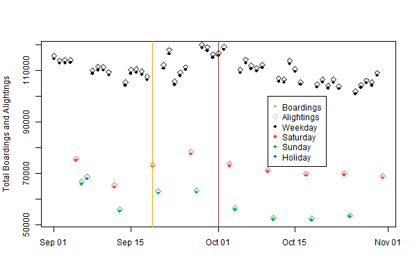

### [Home](README.md) | [Projects](Projects.md) | [Notes](Notes.md) | [Resume](docs/Adam_R_Rohde_Resume.pdf)

---

Find my latest projects below! More to come! See my resume for brief descriptions of my work at Charles River Associates. 

### Twitter readers' experience of algorithmic amplification of US politicians over time (draft forthcoming soon)
with Luca Belli

Designed and carried out causal study of algorithmic amplification experienced by US Twitter users for content generated by US national legislators. Paper and results are forthcoming. 

---

### Revisiting Sample Selection as a Threat to Internal Validity (draft forthcoming soon)
with Chad Hazlett

Researchers often seek to estimate the effect of a treatment on an outcome within a sample that has been drawn in some selective way from a (well-defined or hypothetical) larger population. Such selective sampling not only changes the population about which we make inferences, but can bias our estimate of the causal effect for the units in the sample. This is problematic both because investigators may be primarily interested in questions about unbiasedly estimating the effect in the observed sample (i.e. "internally valid", Campbell (1957)) or because it is not possible to know what the effect would be in any other population if we cannot first obtain an unbiased estimate in the observed sample---a result we formalize below. That selective sampling can threaten even internal validity has long been known, and over the decades different research traditions have offered guidelines for assessing the threats to internal validity posed by sample selection. We employ formal tools from the theory of causal inference to more fully and rigorously characterize the (i) the settings in which selective sampling does and does not bias the "internal effect estimate," and (ii) the conditions under which this bias can theoretically be corrected, and how to do so. These results are collectively conveyed through graphical criterion that investigators can apply on their own to examine the threats to bias and opportunities for correction given a graphical causal model.

---

### Sensitivity Analysis for Sample Selection and Internal Validity (in progress)
with Chad Hazlett

As identified by above project, sample selection bias is central threat to the internal validity of causal effect estimates. When covariate adjustment using observed data is insufficient to identify causal effects due to sample selection, we suggest that researchers use sensitivity analysis. In this paper we [1] show formally how sample selection (and confounding) of any sort for internal validity can be treated as an omitted variable problem, [2] illustrate how the previous point means we can leverage existing sensitivity analysis frameworks that rely on the omitted variable paradigm (e.g., Cinelli and Hazlett (2020) and Chernozhukov et al (2022)) for sample selection, [3] discuss how the sensitivity parameters in such frameworks, in the sample selection setting, can be uninterpretable, and [4] show how to bound these uninterpretable parameters with something more easily interpreted. 

---

### Instrumental Variables under Sample Selection: Graphs, Threats, and Opportunities (in progress)
with Chad Hazlett

The instrumental variables approach has been presented as a potential solution to suspicions that standard causal effect estimates may be biased by unobserved confounders. The requirements for a valid instrumental variables approach to overcome unobserved confounding are demanding. Even when these demands are met, we typically estimate such an effect from a sample of units, which is selected in some not necessarily random way. A long-standing concern of central interest to many investigators is whether the sample selection process biases causal effect estimates even as they pertain to the sample in hand. In keeping with research traditions in a number of disciplines, we consider the property of "internal validity," meaning that an estimate is unbiased for the target causal effect averaged over the sample in hand. Whether the sample selection process biases the instrumental variables estimate as it pertains to the sample in hand and whether any sample selection bias between a treatment and outcome can be corrected by an instrumental variables approach are questions that require a more rigorous framework of analysis than currently exists. We need a framework for determining when instrumental variables estimates in the given sample have been biased by sample selection processes, when the correct estimate can be recovered, and how. To this end we propose formal graphical criteria focused on the internal validity of instrumental variables, and provide tools enabling researchers to easily determine how sample selection may threaten this validity, as well as what might be able to be done about it. While highlighting the high bar for instrument validity, our framework also illuminates opportunities for the use of instrumental variables approaches that have not been widely discussed in the literature.

---
### Stanford CISIL Data Challenge 2022
with David Ami Wulf, Pablo Geraldo, Sarah Sotoudeh, Chad Hazlett, and Onyebuchi Arah

Studied causal relationship between King County Metro Transit fare reinstatement on October 1, 2020 and ridership overall and by socio-economic group. Used an interrupted time series design and a variety of estimation strategies. Personal contribution: designed, conducted, and wrote up interrupted time series analyses. 

[Paper](docs/CISIL_Q1_Methods.pdf)

---
### Rational Bias in Inflation Expectations
with Robert Murphy

Using generalized method of moments, estimated a structural model of the economy to directly test hypotheses about whether inflation expectations respond rationally to food and energy price movements.

Murphy, R., Rohde, A. Rational Bias in Inflation Expectations. Eastern Econ J44, 153–171 (2018) doi:10.1057/eej.2015.50

[Paper](https://link.springer.com/article/10.1057%2Feej.2015.50)

[Final Working Version](docs/Rational-Bias-in-Inflation-Expectations-Working.pdf)

---
### Modern Model-Based Bayesian Causal Inference for Randomized Experiments with Hamiltonian Monte Carlo in Stan

We explore the components of modern model-based Bayesian causal inferenece with a focus on randomized experiments. We discuss the potential outcomes framework, the Bayesian approach to causal inference, the MCMC sampling method Hamiltonian Monte Carlo, and the Stan probabilistic programming language. We also work through a simple example to illustrate how these components come together.

[Paper](docs/Bayesian-Causal-Inference-for-Randomized-Experiments-with-HMC.pdf)

[Repository](https://github.com/Adam-Rohde/Bayesian-Causal-Inference-for-Randomized-Experiments-with-HMC)

---
### Screening AlexNet Hyperparameters with MNIST
with Ashley Chiu

We deploy an experimental approach to hyperparameter tuning in the context of AlexNet. We investigate AlexNet’s innovations, amongst other hyperparameters known to influence accuracy, to screen for the most important hyperparameters in an AlexNet-type CNN.

[Paper](docs/screening-alexnet-hyperparameters-with-mnist.pdf)

[Repository](https://github.com/Adam-Rohde/Screening-AlexNet-Hyperparameters-with-MNIST)

---
### Cooking Up Recipes: A Recipe Recommender Based on Text Similarity
with Ashley Chiu and Ritvik Kharkar

In this project we use a range natural language processing techniques (bag of words, Doc2vec, recurrent neural networks-based LSTM models, and pre-trained language model BERT) to learn vector space embeddings for cooking recipes. We use these embeddings to determine similarity between recipes and recommend such similar recipes, based on user input to a web demo app. We assess the quality of recommendations and embeddings by human review, PCA, and cluster analysis, finding that our models produced mixed results. Generally, simpler models seem to perform best.

[Paper](docs/Cooking-Up-Recipes-A-Recipe-Recommender-Based-on-Text-Similarity.pdf)

[Repository](https://github.com/Adam-Rohde/nlp-recipe-project)

---
### Political Extremism and Election System: A Study of Confounding of the Results of Single Round versus Runoff Elections under Plurality Rule
with Xuan Huynh, Andrew Shapiro, and Brandon Thoma

The conclusions of Bordignon, Nannicini, and Tabellini (2016) with respect to the effects of runoff elections on political participation and policy volatility provide informative results that positively add to the discussion of the benefits of different electoral systems on societal political behavior and economic stability. The sensitivity of the authors’ results survive the most common robustness challenges under a Regression Discontinuity Design, yet unobserved confounding ultimately remains possible but unable to be fully explored due to lack of Italian-specific knowledge. Additional studies are ultimately necessary to validate the results for a more recent Italian electorate, and to study the ability to generalize such results to countries outside of Italy.

[Paper](docs/Political-Extremism-and-Election-System.pdf)

[Slides](docs/Political-Extremism-and-Election-System-Slides.pdf)

[Repository](https://github.com/Adam-Rohde/Political-Extremism-and-Election-System)

---
### ATP Tennis Match Data Analysis (In Progress)

I explore and analyze ATP match level data from 1968 to 2020. The goal is to have some fun exploring historical match data and to see what interesting trends we can uncover. The code and discussion of results are all in Jupyter notebooks at this point (see repository). The work I've done so far and hope to do includes:

* Explore the data.
* Cleaning the data and building a database.
* Calculating Elo Ratings.
* Performing simple analyses that I found interesting. There will surely be more of these to come. 
    * Are older players doing better?  
    * How many matches are typically in a player's career and how many years does a typical career last?
    * How many players have been ranked number 1 and how can we visualize which players dominated during different periods of time?
    * How do the results for best-of-three versus best-of-five set matches differ? (In Progress)
    * How does handedness effect matchups? (In Progress)
* Build models for predicting match winner incorporating match and player information, head-to-head statistics, as well as Elo ratings. (In Progress but there is some initial work on this.)
* Build a web app that provides player profiles, match up predictions, match up histories, Elo ratings, other fun things.  (In Progress)

[Repository](https://github.com/Adam-Rohde/ATP-Tennis)

---
### SVD-Based Watermarking Schemes
with Ian McGovern and Annie Zhang

This paper surveys techniques for digital image watermarking that employ singular value decomposition as a method for embedding watermarks imperceptibly in images. Multiple desirable qualities of digital watermarks are explained and their balance discussed. Three foundational papers are discussed in detail, implemented in Python, and experiments on these methods are conducted. We find that simpler methods tend to have better performance but at the cost of higher computational intensity. We discuss extensions to these schemes as well as practical applications in areas from medicine to copyright protection.

[Paper](docs/McGovern-Rohde-Zhang-SVD-Based-Watermarking-Schemes.pdf)

[Repository](https://github.com/Adam-Rohde/SVD-Based-Watermarking-Schemes)

