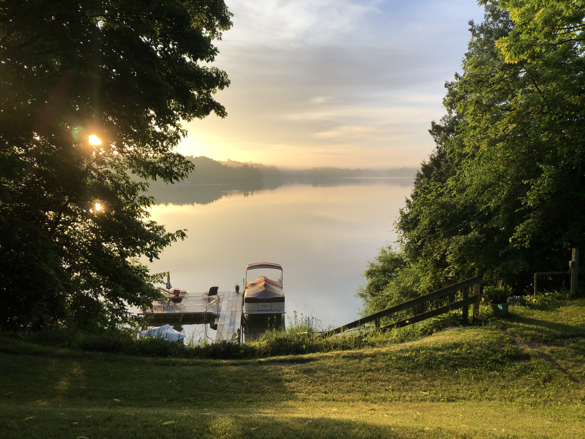

### [Projects](Projects.md) | [Resume](docs/adam-r-rohde-resume.pdf)

---

Isle of Skye, June 2019

---
### About Me

I’m a graduate student in [Statistics at UCLA](http://statistics.ucla.edu/). My research interests are causal inference, computational statistics, and machine learning. I’m passionate about leveraging data and statistics to drive insights that improve systems and outcomes for individuals.

I worked at [Charles River Associates](http://www.crai.com/), an economic consulting firm, for six years before starting at UCLA. There I analyzed data and built statistical and economic models focused on regulation related to mergers, acquisitions, and antitrust litigation. I designed and conducted empirical analyses of market dynamics in a variety of industries on over 30 cases. I explored, cleaned, manipulated, and analyzed large, proprietary datasets (e.g., shipment data, transaction data, claims data, prescription data) to understand competition, pricing, and client operations. In this work, I modeled prices, demand, willingness-to-pay, market share, market size, and other key factors to estimate effects of anticompetitive acts, potential mergers, and prevailing market conditions. While at CRA, I led teams of analysts on quantitative projects, mentored junior staff, and provided guidance and expertise to colleagues related to data anlaysis (in particular, programming in SAS).

I did my undergrad at Boston College, where I studied Mathematics and Economics. There I did research with Bob Murphy related to whether inflation expectations respond rationally to food and energy price movements. This work was presented at the 2015 AEA Meetings in Boston and published in the Eastern Economic Journal.

I grew up in Minnesota, lived in Boston for eight years, spent 2 years Berkeley and Oakland, and moved to Los Angeles in the summer of 2019.

---
### Contact

Don’t hesitate to reach out!

Los Angeles, CA

adamrohde@ucla.edu

[UCLA Statistics](http://directory.stat.ucla.edu/active_students/single-page/?smid=1612)

[LinkedIn](https://www.linkedin.com/in/adam-rohde)

[GitHub](https://github.com/Adam-Rohde)

--- 

Elkhart Lake, WI, July 2019
