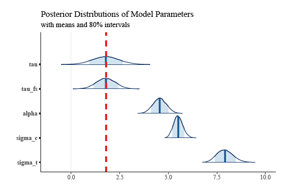

### [Home](README.md) | [Research](Research.md) | [Notes](Notes.md) | [Resume](docs/Adam_R_Rohde_Resume.pdf)

---

Find my latest research below! More to come! See my resume for brief descriptions of my work at Charles River Associates. 

### Causal progress with imperfect placebo treatments and outcomes
with Chad Hazlett

In the quest to make defensible causal claims from observational data, it is sometimes possible to leverage information from “placebo outcomes” (aka “negative outcome controls”) or “placebo treatments”. Traditional approaches employing such information typically focus on point identification and assume (i) that these are “perfect placebos” (treatment has precisely zero effect on a placebo outcome, or placebo treatments have precisely zero effects on the outcome of interest); and (ii) that the placebo outcome/treatment suffers the same amount of confounding as does the real treatment- outcome relationship on some scale (“equi-confounding”). We show how the analysis of “omitted variable bias” in regression provides a flexible and powerful way to leverage information from placebo treatments and outcomes while relaxing these assumptions. Specifically, we provide a sensitivity analysis or partial identification framework in which users can see the implications of any claim they choose to make about the relative strengths of confounding suffered by a placebo treatment/outcome compared to the true treatment-outcome relationship, while allowing for “imperfect placebos” (e.g. placebo treatments with some non-zero effect on the outcome, placebo outcomes somewhat affected by the treatment). These tools can be used with any choice of placebo treatment or outcome, observed in the same dataset or in a separate one as the main treatment-outcome relationship. We also frame the conventional difference-in-difference approach as a special case of this, with a strict equi-confounding assumption regarding the pre-treatment outcome’s relationship to the treatment group indicator, to which our approach allows several useful relaxations. 

[Draft](docs/Causal_progress_with_imperfect_placebos.pdf)

---

### Twitter readers' experience of algorithmic amplification of US politicians over time (draft forthcoming soon)
with Luca Belli

Designed and carried out causal study of algorithmic amplification experienced by US Twitter users for content generated by US national legislators. Paper and results are forthcoming. 

---

### Revisiting sample selection as a threat to internal validity: A new analytical tool, lessons, and examples
with Chad Hazlett

Researchers often seek to estimate the effect of a treatment on an outcome within a sample that has been drawn in some selective way from a larger population. Such selective sampling not only changes the population about which we make inferences, but can bias our estimate of the causal effect for the units in the sample, thus threatening the “internal validity” of the estimate (Campbell (1957)). Further, it is not possible to know what the causal effect would be in any other population of eventual interest if we cannot first obtain an unbiased estimate in the observed sample—a result we formalize below. That selective sampling can threaten even internal validity has long been known, and over the decades different research traditions have offered guidelines for assessing the threats to internal validity posed by sample selection. We employ formal graphical tools for causal reasoning to more fully and rigorously characterize the (i) the settings in which selective sampling does and does not bias the “internal effect estimate”, and (ii) the conditions under which this bias can theoretically be corrected, and how to do so. These results are collectively conveyed through a graphical criterion that investigators can apply in their circumstances to examine the threats to bias and opportunities for correction given a graphical causal model. A number of common lessons emerge, including that many forms of selection, including selection processes influenced by the treatment or a mediator, are not always problematic. That said, the central lesson is that many complications may arise, requiring the researcher to to use these tools to examine how selection processes bias the result or can be corrected under specific causal structures the user cannot reject as plausible.

[Draft](docs/Revisiting_Sample_Selection_as_a_Threat_to_Internal_Validity.pdf)

---

### When Observed Data Just Isn’t Enough: Omitted Variable Based Sensitivity Analysis for Sample Selection as a Threat to Internal Validity
with Chad Hazlett

Sample selection is a common threat to the internal validity of causal effect estimates. While Rohde and Hazlett (20XX) discusses these threats at length and provides guidance on how covariate adjustment can be use to address them, what should researchers do when observed covariates are insufficient to eliminate these threats? We show how researchers can use omitted variable based sensitivity analyses to do this. In particular, we discuss the omitted variable based sensitivity analyses of Cinelli and Hazlett (2020) and Chernozhukov et al. (2022) and how these can be leveraged to evaluate threats from sample selection. However, since sample selection as a threat to internal validity is typically the result of collider stratification, the parameters in such sensitivity analyses can be difficult to interpret. We show how more interpretable expressions for the sensitivity parameters in these frameworks can be derived in some simple, parametric settings. Using these as a guide, we also propose bounds on the parameters for general, non-parametric settings using notions from information theory. A worked example and discussion are provided.

[Draft](docs/Sensitivity_Analysis_for_Sample_Selection_and_Internal_Validity.pdf)

---

### Instrumental Variables with Sample Selection: Opportunities, Threats, and Graphs
with Chad Hazlett

In this paper, we discuss interesting cases in which sample selection presents opportunities to use instrumental variables and in which using instrumental variables can be used to overcome sample selection. However, we discuss how these opportunities may arise only in very specific settings, as is the case for credible instrumental variables in general. We also discuss the numerous threats that sample selection can pose to the credibility of instrumental variable approaches. To facilitate this discussion, we revise existing graphical criteria for instrumental variables to highlight the special role that sample selection plays in the instrumental variables setting. We do this by first introducing an extension to typical causal graphs that visualizes how sample selection alters the relationships between variables in the sample. We then provide rules (graphical criteria) that allow researchers to use these extended graphs to evaluate the key assumptions of instrumental variables in their own applications, while responsibly accounting for sample selection. In this way, we generalize recent discussions of sample selection and instrumental variables and connect these to existing graphical criteria. Moreover, we emphasize the importance of including a sample selection node in all causal graphs, warn of the dangers of applying simple heuristics about sample selection, and suggest that practitioners appeal to formal approaches like those we present to understand how sample selection may threaten the validity of instrumental variables in their specific applications.

[Draft](docs/Instrumental_Variables_and_Sample_Selection.pdf)

---
### Stanford CISIL Data Challenge 2022
with David Ami Wulf, Pablo Geraldo, Sarah Sotoudeh, Chad Hazlett, and Onyebuchi Arah

Studied causal relationship between King County Metro Transit fare reinstatement on October 1, 2020 and ridership overall and by socio-economic group. Used an interrupted time series design and a variety of estimation strategies. Personal contribution: designed, conducted, and wrote up interrupted time series analyses. 

[Paper](docs/CISIL_Q1_Methods.pdf)

---
### Rational Bias in Inflation Expectations
with Robert Murphy

Using generalized method of moments, estimated a structural model of the economy to directly test hypotheses about whether inflation expectations respond rationally to food and energy price movements.

Murphy, R., Rohde, A. Rational Bias in Inflation Expectations. Eastern Econ J44, 153–171 (2018) doi:10.1057/eej.2015.50

[Paper](https://link.springer.com/article/10.1057%2Feej.2015.50)

[Final Working Version](docs/Rational-Bias-in-Inflation-Expectations-Working.pdf)

---
### Modern Model-Based Bayesian Causal Inference for Randomized Experiments with Hamiltonian Monte Carlo in Stan

We explore the components of modern model-based Bayesian causal inferenece with a focus on randomized experiments. We discuss the potential outcomes framework, the Bayesian approach to causal inference, the MCMC sampling method Hamiltonian Monte Carlo, and the Stan probabilistic programming language. We also work through a simple example to illustrate how these components come together.

[Paper](docs/Bayesian-Causal-Inference-for-Randomized-Experiments-with-HMC.pdf)

[Repository](https://github.com/Adam-Rohde/Bayesian-Causal-Inference-for-Randomized-Experiments-with-HMC)

---
### Screening AlexNet Hyperparameters with MNIST
with Ashley Chiu

We deploy an experimental approach to hyperparameter tuning in the context of AlexNet. We investigate AlexNet’s innovations, amongst other hyperparameters known to influence accuracy, to screen for the most important hyperparameters in an AlexNet-type CNN.

[Paper](docs/screening-alexnet-hyperparameters-with-mnist.pdf)

[Repository](https://github.com/Adam-Rohde/Screening-AlexNet-Hyperparameters-with-MNIST)

---
### Cooking Up Recipes: A Recipe Recommender Based on Text Similarity
with Ashley Chiu and Ritvik Kharkar

In this project we use a range natural language processing techniques (bag of words, Doc2vec, recurrent neural networks-based LSTM models, and pre-trained language model BERT) to learn vector space embeddings for cooking recipes. We use these embeddings to determine similarity between recipes and recommend such similar recipes, based on user input to a web demo app. We assess the quality of recommendations and embeddings by human review, PCA, and cluster analysis, finding that our models produced mixed results. Generally, simpler models seem to perform best.

[Paper](docs/Cooking-Up-Recipes-A-Recipe-Recommender-Based-on-Text-Similarity.pdf)

[Repository](https://github.com/Adam-Rohde/nlp-recipe-project)

---
### Political Extremism and Election System: A Study of Confounding of the Results of Single Round versus Runoff Elections under Plurality Rule
with Xuan Huynh, Andrew Shapiro, and Brandon Thoma

The conclusions of Bordignon, Nannicini, and Tabellini (2016) with respect to the effects of runoff elections on political participation and policy volatility provide informative results that positively add to the discussion of the benefits of different electoral systems on societal political behavior and economic stability. The sensitivity of the authors’ results survive the most common robustness challenges under a Regression Discontinuity Design, yet unobserved confounding ultimately remains possible but unable to be fully explored due to lack of Italian-specific knowledge. Additional studies are ultimately necessary to validate the results for a more recent Italian electorate, and to study the ability to generalize such results to countries outside of Italy.

[Paper](docs/Political-Extremism-and-Election-System.pdf)

[Slides](docs/Political-Extremism-and-Election-System-Slides.pdf)

[Repository](https://github.com/Adam-Rohde/Political-Extremism-and-Election-System)

---
### ATP Tennis Match Data Analysis (In Progress)

I explore and analyze ATP match level data from 1968 to 2020. The goal is to have some fun exploring historical match data and to see what interesting trends we can uncover. The code and discussion of results are all in Jupyter notebooks at this point (see repository). The work I've done so far and hope to do includes:

* Explore the data.
* Cleaning the data and building a database.
* Calculating Elo Ratings.
* Performing simple analyses that I found interesting. There will surely be more of these to come. 
    * Are older players doing better?  
    * How many matches are typically in a player's career and how many years does a typical career last?
    * How many players have been ranked number 1 and how can we visualize which players dominated during different periods of time?
    * How do the results for best-of-three versus best-of-five set matches differ? (In Progress)
    * How does handedness effect matchups? (In Progress)
* Build models for predicting match winner incorporating match and player information, head-to-head statistics, as well as Elo ratings. (In Progress but there is some initial work on this.)
* Build a web app that provides player profiles, match up predictions, match up histories, Elo ratings, other fun things.  (In Progress)

[Repository](https://github.com/Adam-Rohde/ATP-Tennis)

---
### SVD-Based Watermarking Schemes
with Ian McGovern and Annie Zhang

This paper surveys techniques for digital image watermarking that employ singular value decomposition as a method for embedding watermarks imperceptibly in images. Multiple desirable qualities of digital watermarks are explained and their balance discussed. Three foundational papers are discussed in detail, implemented in Python, and experiments on these methods are conducted. We find that simpler methods tend to have better performance but at the cost of higher computational intensity. We discuss extensions to these schemes as well as practical applications in areas from medicine to copyright protection.

[Paper](docs/McGovern-Rohde-Zhang-SVD-Based-Watermarking-Schemes.pdf)

[Repository](https://github.com/Adam-Rohde/SVD-Based-Watermarking-Schemes)

